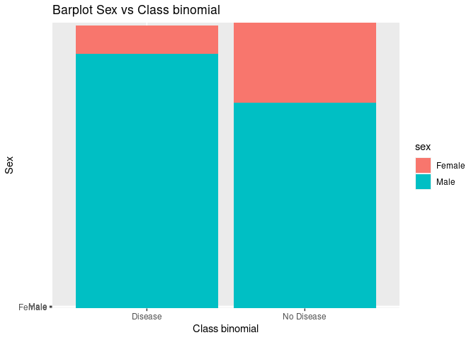
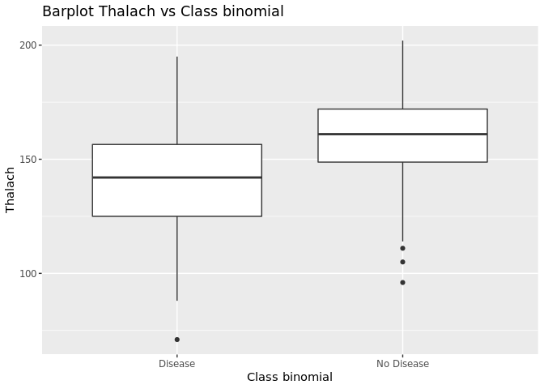

# Heart Risk

The goal of Heart-Risk is to …

------------------------------------------------------------------------

## Export and visualitation of data

First, We going to export the dataset from MYSQL using the package DBI,
the head of the dataset is following:

    #>   age sex cp trestbps chol fbs restecg thalach exang oldpeak slope ca thal
    #> 1  63   1  1      145  233   1       2     150     0     2.3     3  0    6
    #> 2  67   1  4      160  286   0       2     108     1     1.5     2  3    3
    #> 3  67   1  4      120  229   0       2     129     1     2.6     2  2    7
    #> 4  37   1  3      130  250   0       0     187     0     3.5     3  0    3
    #> 5  41   0  2      130  204   0       2     172     0     1.4     1  0    3
    #> 6  56   1  2      120  236   0       0     178     0     0.8     1  0    3
    #>   class
    #> 1     0
    #> 2     2
    #> 3     1
    #> 4     0
    #> 5     0
    #> 6     0

Let’s describe the variables:

-   **Description’s variables**

Once We known the decription of the variables, now, as we want to know
if a person might have Heart disease or not, so, We will tranform to
binary the *class* variable, and as factor the variable *sex* for work
better with the data.

    #> 'data.frame':    303 obs. of  15 variables:
    #>  $ age           : num  63 67 67 37 41 56 62 57 63 53 ...
    #>  $ sex           : Factor w/ 2 levels "Female","Male": 2 2 2 2 1 2 1 1 2 2 ...
    #>  $ cp            : num  1 4 4 3 2 2 4 4 4 4 ...
    #>  $ trestbps      : num  145 160 120 130 130 120 140 120 130 140 ...
    #>  $ chol          : num  233 286 229 250 204 236 268 354 254 203 ...
    #>  $ fbs           : num  1 0 0 0 0 0 0 0 0 1 ...
    #>  $ restecg       : num  2 2 2 0 2 0 2 0 2 2 ...
    #>  $ thalach       : num  150 108 129 187 172 178 160 163 147 155 ...
    #>  $ exang         : num  0 1 1 0 0 0 0 1 0 1 ...
    #>  $ oldpeak       : num  2.3 1.5 2.6 3.5 1.4 0.8 3.6 0.6 1.4 3.1 ...
    #>  $ slope         : num  3 2 2 3 1 1 3 1 2 3 ...
    #>  $ ca            : num  0 3 2 0 0 0 2 0 1 0 ...
    #>  $ thal          : num  6 3 7 3 3 3 3 3 7 7 ...
    #>  $ class         : num  0 2 1 0 0 0 3 0 2 1 ...
    #>  $ class_binomial: num  0 1 1 0 0 0 1 0 1 1 ...

As you can see We already have converted the class and sex variables,
now, let’s identify the **Relevant** variables.

------------------------------------------------------------------------

## Exploring the data

-   Recommendation: Review concepts of t-test (Welch’s t-test) and
    Chi-squared to identify relevant variables.

**a)** We test the Chi function between the variables *Sex* and
*class\_binomial*, we obtain.

    #> 
    #>  Pearson's Chi-squared test with Yates' continuity correction
    #> 
    #> data:  data$sex and data$class_binomial
    #> X-squared = 22.043, df = 1, p-value = 2.667e-06

**b)** We test the t-test function between the variables *Age* and
*class\_binomial*, we obtain.

    #> 
    #>  Welch Two Sample t-test
    #> 
    #> data:  data$age and data$class_binomial
    #> t = 103.8, df = 303.84, p-value < 2.2e-16
    #> alternative hypothesis: true difference in means is not equal to 0
    #> 95 percent confidence interval:
    #>  52.95685 55.00355
    #> sample estimates:
    #>  mean of x  mean of y 
    #> 54.4389439  0.4587459

**c)** We test the t-test function between the variables *Thalach* and
*class\_binomial*, we obtain.

    #> 
    #>  Welch Two Sample t-test
    #> 
    #> data:  data$thalach and data$class_binomial
    #> t = 113.47, df = 302.29, p-value < 2.2e-16
    #> alternative hypothesis: true difference in means is not equal to 0
    #> 95 percent confidence interval:
    #>  146.5619 151.7351
    #> sample estimates:
    #>   mean of x   mean of y 
    #> 149.6072607   0.4587459

-   **Conclusion of tests**

------------------------------------------------------------------------

## Visualitation of data

Let’s plot some relevant variables to have an idea about the
distribution of it.

<!-- -->

<!-- -->

<!-- -->

-   **Conclusion of plots**

------------------------------------------------------------------------

## Logistic Regression
