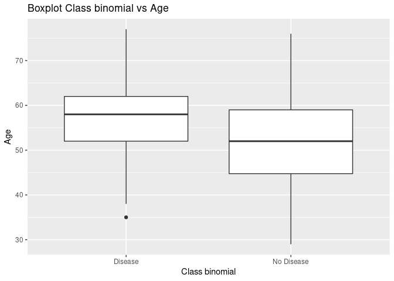
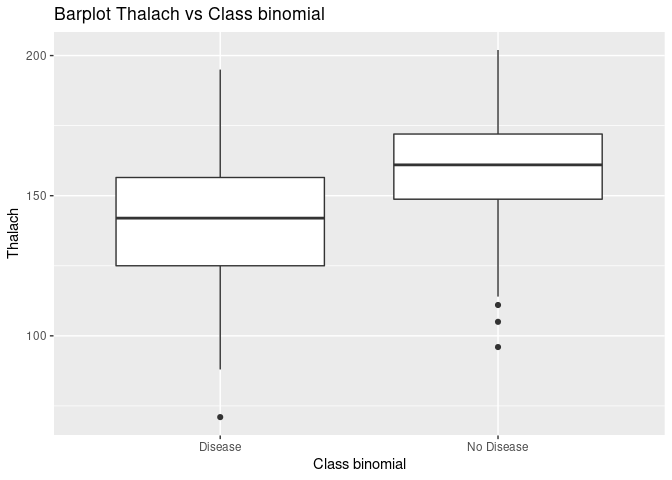

# Heart Risk

The goal of Heart-Risk is to …

------------------------------------------------------------------------

## Export and visualitation of data

First, We going to export the dataset from MYSQL using the package DBI,
the head of the dataset is following:

    #>   age sex cp trestbps chol fbs restecg thalach exang oldpeak slope ca thal
    #> 1  63   1  1      145  233   1       2     150     0     2.3     3  0    6
    #> 2  67   1  4      160  286   0       2     108     1     1.5     2  3    3
    #> 3  67   1  4      120  229   0       2     129     1     2.6     2  2    7
    #> 4  37   1  3      130  250   0       0     187     0     3.5     3  0    3
    #> 5  41   0  2      130  204   0       2     172     0     1.4     1  0    3
    #> 6  56   1  2      120  236   0       0     178     0     0.8     1  0    3
    #>   class
    #> 1     0
    #> 2     2
    #> 3     1
    #> 4     0
    #> 5     0
    #> 6     0

Let’s describe some variables:

-   **Class:** This variable classifies from 0 to 4 the diagnostic or
    probably of having the disease, where 0 means No sick, 1, 2 and 3
    means little probably having disease and 4 means a lot of probably
    having disease.

-   **Thalach:** Maximum blood pressure found.

-   **Chol:** Cholesterol in mg/dl.

-   **Fbs:** Blood pressure Fasting.

-   **Trestbps:** Blood pressure resting.

-   **Testecg:** Induced blood acceleration.

-   **Oldpeak:** Induced depression for relative exercise to test.

-   **Sex:** The sex of the people classify in Female and Male.

-   **Age:** The age of the people.

Once We known the decription of the variables, now, as we want to know
if a person might have Heart disease or not, so, We will tranform to
binary the *class* variable, and as factor the variable *sex* for work
better with the data.

    #> 'data.frame':    303 obs. of  15 variables:
    #>  $ age           : num  63 67 67 37 41 56 62 57 63 53 ...
    #>  $ sex           : Factor w/ 2 levels "Female","Male": 2 2 2 2 1 2 1 1 2 2 ...
    #>  $ cp            : num  1 4 4 3 2 2 4 4 4 4 ...
    #>  $ trestbps      : num  145 160 120 130 130 120 140 120 130 140 ...
    #>  $ chol          : num  233 286 229 250 204 236 268 354 254 203 ...
    #>  $ fbs           : num  1 0 0 0 0 0 0 0 0 1 ...
    #>  $ restecg       : num  2 2 2 0 2 0 2 0 2 2 ...
    #>  $ thalach       : num  150 108 129 187 172 178 160 163 147 155 ...
    #>  $ exang         : num  0 1 1 0 0 0 0 1 0 1 ...
    #>  $ oldpeak       : num  2.3 1.5 2.6 3.5 1.4 0.8 3.6 0.6 1.4 3.1 ...
    #>  $ slope         : num  3 2 2 3 1 1 3 1 2 3 ...
    #>  $ ca            : num  0 3 2 0 0 0 2 0 1 0 ...
    #>  $ thal          : num  6 3 7 3 3 3 3 3 7 7 ...
    #>  $ class         : num  0 2 1 0 0 0 3 0 2 1 ...
    #>  $ class_binomial: num  0 1 1 0 0 0 1 0 1 1 ...

As you can see We already have converted the class and sex variables,
now, let’s identify the **Relevant** variables.

------------------------------------------------------------------------

## Exploring the data

-   Recommendation: Review concepts of t-test (Welch’s t-test) and
    Chi-squared to identify relevant variables.

**a)** We test the Chi function between the variables *Sex* and *Class
binomial*, we obtain.

    #> 
    #>  Pearson's Chi-squared test with Yates' continuity correction
    #> 
    #> data:  data$sex and data$class_binomial
    #> X-squared = 22.043, df = 1, p-value = 2.667e-06

**b)** We test the t-test function between the variables *Age* and
*Class binomial*, we obtain.

    #> 
    #>  Welch Two Sample t-test
    #> 
    #> data:  data$age and data$class_binomial
    #> t = 103.8, df = 303.84, p-value < 2.2e-16
    #> alternative hypothesis: true difference in means is not equal to 0
    #> 95 percent confidence interval:
    #>  52.95685 55.00355
    #> sample estimates:
    #>  mean of x  mean of y 
    #> 54.4389439  0.4587459

**c)** We test the t-test function between the variables *Thalach* and
*Class binomial*, we obtain.

    #> 
    #>  Welch Two Sample t-test
    #> 
    #> data:  data$thalach and data$class_binomial
    #> t = 113.47, df = 302.29, p-value < 2.2e-16
    #> alternative hypothesis: true difference in means is not equal to 0
    #> 95 percent confidence interval:
    #>  146.5619 151.7351
    #> sample estimates:
    #>   mean of x   mean of y 
    #> 149.6072607   0.4587459

We can see the p-values of the three tests, and we can observe that its
values are very small (which this is very excellent).

------------------------------------------------------------------------

## Visualitation of data

Let’s plot some relevant variables to have an idea about the
distribution of it.

<!-- -->

<!-- -->

<!-- -->

We can see that the range between 50 and 60 age are important for having
a disease, the same thing happen with the range between 125 and 150
maximum blood pressure, on the other hand the sex doesn’t care too much,
We can say that the sex variable it’s independent.

------------------------------------------------------------------------

## Logistic Regression

    #> 
    #> Call:
    #> glm(formula = class_binomial ~ age + thalach + sex, family = "binomial", 
    #>     data = data)
    #> 
    #> Deviance Residuals: 
    #>     Min       1Q   Median       3Q      Max  
    #> -2.2250  -0.8486  -0.4570   0.9043   2.1156  
    #> 
    #> Coefficients:
    #>              Estimate Std. Error z value Pr(>|z|)    
    #> (Intercept)  3.111610   1.607466   1.936   0.0529 .  
    #> age          0.031886   0.016440   1.940   0.0524 .  
    #> thalach     -0.040541   0.007073  -5.732 9.93e-09 ***
    #> sexMale      1.491902   0.307193   4.857 1.19e-06 ***
    #> ---
    #> Signif. codes:  0 '***' 0.001 '**' 0.01 '*' 0.05 '.' 0.1 ' ' 1
    #> 
    #> (Dispersion parameter for binomial family taken to be 1)
    #> 
    #>     Null deviance: 417.98  on 302  degrees of freedom
    #> Residual deviance: 332.85  on 299  degrees of freedom
    #> AIC: 340.85
    #> 
    #> Number of Fisher Scoring iterations: 4

We note that, in our model, the *SexMale* and *Thalach* variables stand
out, their p-values are tinny but, the coefficient of *Thalach* is
almost zero on another hand with sexMale, while *SexMale’s*’ coefficient
is positive, obviously, the model can be much better.

------------------------------------------------------------------------

## Useful information about the model

    #> Loading required package: broom
    #> Waiting for profiling to be done...
    #> # A tibble: 4 x 8
    #>   term        estimate std.error statistic       p.value     OR `2.5 %` `97.5 %`
    #>   <chr>          <dbl>     <dbl>     <dbl>         <dbl>  <dbl>   <dbl>    <dbl>
    #> 1 (Intercept)   3.11     1.61         1.94 0.0529        22.5     0.995  555.   
    #> 2 age           0.0319   0.0164       1.94 0.0524         1.03    1.00     1.07 
    #> 3 thalach      -0.0405   0.00707     -5.73 0.00000000993  0.960   0.947    0.973
    #> 4 sexMale       1.49     0.307        4.86 0.00000119     4.45    2.47     8.27

-   **Conclusion of Model information**

------------------------------------------------------------------------

## Predictive probabilities of the model

    #> [1] 70.9571

-   **Conclusion of Predictive model and accuracy**
